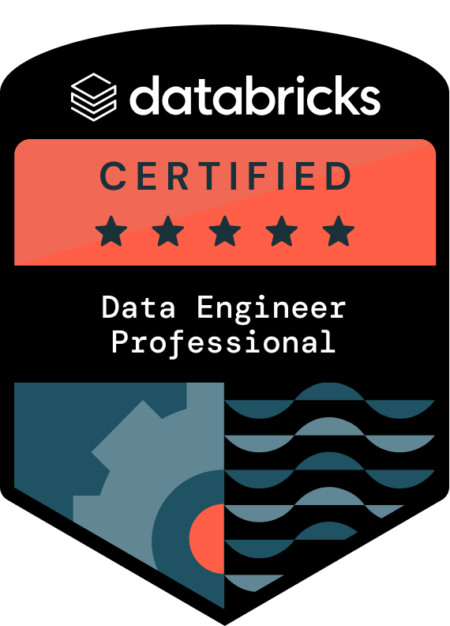
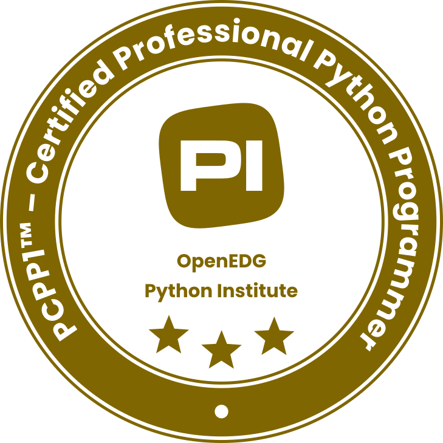

# PDI - Plano de Desenvolvimento Individual

---
Durante minhas experiências profissionais, tive muito contato com a área de dados e adquiri grande familiaridade com práticas de ETL e análise de dados. E, ao decorrer do curso, percebi que tenho maior domínio no que diz respeito ao back-end.
Por esse motivo, para o meu Plano de Desenvolvimento Pessoal, desejo focar em estudos relacionados à Engenharia de Dados e Back-End, principalmente a área de Data Engineering.

## 🎯 Objetivo

Desejo desenvolver um domínio sólido em conceitos fundamentais de algoritmos e estruturas de dados. Atualmente possuo níveis iniciais ou intermediários nesses tópicos e pretendo evoluir principalmente na capacidade de analisar eficiência de algoritmos, compreender o comportamento da memória e escolher estruturas de dados adequadas para otimizar performance. Paralelamente, também busco alcançar domínio completo da linguagem Python, ampliando minha capacidade de desenvolver soluções robustas e eficientes. Além disso, pretendo aprofundar meus conhecimentos em engenharia de dados, utilizando ferramentas e tecnologias como Databricks, Apache Spark, Delta Lake e SQL para manipulação, processamento e organização de grandes volumes de dados. 
O desenvolvimento dessas competências está diretamente conectado ao meu objetivo acadêmico e profissional de atuar nas áreas de Engenharia de Dados e desenvolvimento back-end, pois compreender profundamente algoritmos, estruturas de dados e processamento eficiente de informações é essencial para construir pipelines de dados escaláveis, sistemas de processamento distribuído e APIs eficientes, que são fundamentais em arquiteturas modernas de software e plataformas orientadas a dados.

---

## 📊 Diagnóstico Inicial

### 📊 Diagnóstico Inicial e Nível de Conhecimento

| Tópico | Nível Atual (1 a 5) | Dificuldade Principal |
| :--- | :--- | :--- |
| **Análise de Complexidade (Big-O)** | 🟩⬜⬜⬜⬜ (1/5) | Compreender como medir tempo/memória e aplicar matematicamente. |
| **Divisão e Conquista** | 🟩🟩⬜⬜⬜ (2/5) | Traduzir a teoria em lógica de programação e código funcional. |
| **Recursão** | 🟩🟩⬜⬜⬜ (2/5) | Entender o comportamento da memória e definir condições de parada. |
| **Programação Dinâmica** | 🟩⬜⬜⬜⬜ (1/5) | Compreensão teórica e identificação de quando aplicar o paradigma. |
| **Estruturas de Dados** | 🟩🟩⬜⬜⬜ (2/5) | Implementar do zero e escolher a melhor estrutura para performance. |
| **Grafos** | 🟩⬜⬜⬜⬜ (1/5) | Compreender teoria de vértices/arestas e algoritmos de busca. |

---
## 📚 Cursos e Progresso -  [Organização via Trello](https://trello.com/invite/b/697a393fc18b548fd2c7140e/ATTIf172a321cb42af2ee83adde4309575c79917BC98/objetivos-de-aprendizagem-para-dataenginner) 

| Curso | Descrição do Curso | Progresso |
|------|------|------|
| **Engenharia de Dados com Databricks** | Curso focado em processamento de dados, pipelines e arquitetura de dados utilizando a plataforma Databricks com projeto em ambiente real Azure + Lakehouse. | 🟩🟩🟩⬜⬜⬜⬜⬜⬜⬜ 35% |
| **Trilha Python** | Desenvolvimento de projetos completos em Python com Estrutura de Dados. | 🟩🟩🟩🟩🟩⬜⬜⬜⬜⬜ 50% |
| **Python Essentials 2** | Curso aprofundado em Python com foco em conceitos intermediários e avançados, preparando para a certificação PCAP – Certified Associate in Python Programming. | 🟩⬜⬜⬜⬜⬜⬜⬜⬜⬜ 10% |
---
## 📅 Rotina Semanal de Estudo

| Dia e Horário | Tipo de Atividade | Descrição |
| :--- | :--- | :--- |
| **Quarta-feira**   19h00 às 21h00 | Teoria e Implementação Básica | Leitura dos conceitos da semana da faculdade, andamento nos cursos, e codificação de exercícios em Python. |
| **Sexta-feira**   09h00 às 12h00 | Prática Intensa e Projeto | Momento focado em resolver exercícios da faculdade, focar em projetos de Data Enginner  |
| **Todos os dias** | Pelo menos 1hr de estudos da faculdade/cursos
---

## 🛠️ Metas Técnicas

### 🎯 Meta 1: Dominar Análise de Complexidade em Scripts de Dados

| Elemento | Detalhe |
| :--- | :--- |
| **Contexto** | Em Engenharia de Dados, processar tarefas de complexidade $O(n^2)$ em um Data Lake com terabytes de dados é inviável. Entender performance é inegociável. |
| **Descrição** | Aprender a calcular a complexidade de tempo e espaço (Notação Big-O) de scripts Python. |
| **Plano de Ação** | Estudar a teoria de Big-O e refatorar 3 scripts simples de Python, anotando a complexidade do "antes e depois" da otimização. |
| **Medição** | Conseguir classificar a complexidade de qualquer função simples em Python sem consultar materiais externos. |
| **Prazo** | A definir|

### 🎯 Meta 2: Desenvolver o Projeto "Mini ETL Nativo" com Estruturas de Dados

| Elemento | Detalhe |
| :--- | :--- |
| **Contexto** | Bancos de dados e o motor do Spark usam árvores e tabelas de espalhamento (hash tables) sob o capô para buscas ultrarrápidas. |
| **Descrição** | Implementar estruturas de dados complexas aplicadas a um problema real de engenharia. |
| **Plano de Ação** | Criar um script Python (sem bibliotecas externas) que lê um arquivo CSV grande, usa *Hash Tables* (Dicionários) para remover duplicatas e uma *Árvore de Busca* para ordenar os dados rapidamente, salvando em um novo arquivo. |
| **Medição** | Projeto rodando sem erros de execução, com o código sendo 100% compreendido e explicado por mim. |
| **Prazo** |  A definir |

---

### 🎯 Meta 3: Aplicar Grafos para Mapeamento de Dependências (Data Lineage)

| Elemento | Detalhe |
| :--- | :--- |
| **Contexto** | Em pipelines de dados, as tarefas rodam em uma ordem específica de dependência, formando os chamados DAGs (Directed Acyclic Graphs), coração de orquestradores como Databricks Workflows e Airflow. |
| **Descrição** | Entender grafos para simular a ordem de execução de tarefas de dados. |
| **Plano de Ação** | Construir um algoritmo simples em Python que recebe 5 tabelas com dependências entre si e usa conceitos de Grafos para definir a ordem exata em que devem ser processadas. |
| **Medição** | O script deve imprimir a ordem correta de execução das tabelas (simulando um *Topological Sort*). |
| **Prazo** | Fim do semestre. |

---

## 🤖 Plano de Uso de IA

* **Apoio:** Para gerar volume de dados fictícios (CSV/JSON) e pedir dicas de erros lógicos.
* **Limites inegociáveis:**
  1. **Deve explicar, não codificar:** Meus prompts exigirão explicações conceituais, sem código pronto.
  2. **Regra do Descarte:** Ler o código e a explicação gerado por IA, porém implementá-lo do zero usando meu próprio raciocínio e sem consultar novamente o código. *Ctrl+C / Ctrl+V proibidos.*
 
## 🏆✨ Plano de Certificações

<table align="center">
<tr>
<td align="center">

**Databricks Data Engineer**

</td>

<td align="center">

**Azure Data Engineer**

</td>

<td align="center">

**Python Profissional**

</td>
</tr>
</table>

